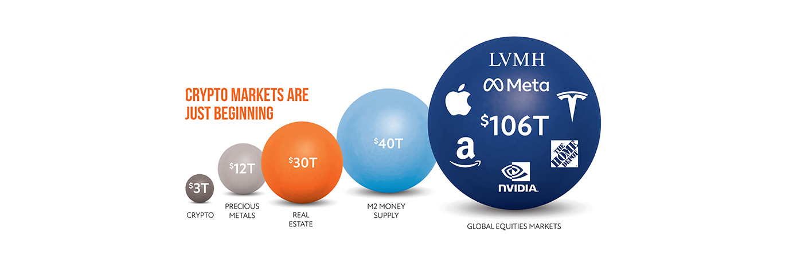
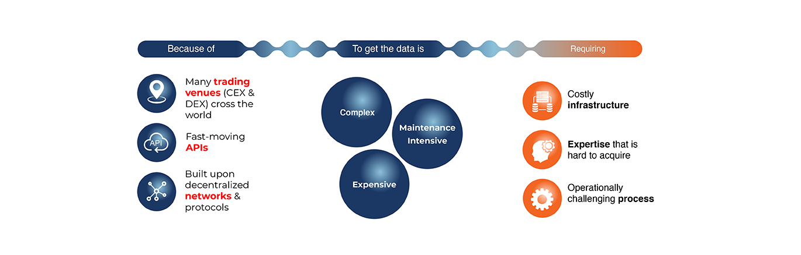

---
weight: 
title: "amberdata"
description: "监控、分析公有与私有区块链的 SaaS 平台"
date: 2022-07-15T21:57:40+08:00
lastmod: 2022-07-15T16:45:40+08:00
draft: false
authors: ["MineW"]
featuredImage: "amberdata.jpg"
link: "https://www.amberdata.io/"
tags: ["数据分析","amberdata"]
categories: ["navigation"]
navigation: ["数据分析"]
lightgallery: true
toc: true
pinned: false
recommend: false
recommend1: false
---
监控、分析公有与私有区块链的 SaaS 平台。

Amberdata 联合创始人兼首席执行官 Shawn Douglas 曾参加以太坊全球社区的发展峰会 EDCON 时表示，固然在过去一周内约 53% 交易业务是通过以太坊区块链智能合约发生，而在 6 个月前这一占比只有约 39%，这亦从侧面反映出 Amberdata 对于链上数据的积累深厚。

#### 您的透镜进入整个加密经济

Amberdata提供全面的数字资产数据和对区块链网络，加密市场和分散式金融的见解，为金融机构提供用于研究，交易，风险，分析，报告和合规性的关键数据。

### 关于安博达

在Amberdata，我们与区块链和加密世界中最优秀的人才合作，将原始的，脱节的加密经济数据转化为高保真，全面和可操作的信息。

#### 未来数字资产和 Web 的基础基础设施3

随着数字资产变得普遍和广泛采用，今天总的市场规模和应用是不可想象的，但随着世界各地的每个个人和企业都采用这项技术，新业务的创建可能代表着数万亿美元。

#### 我们的使命

在Amberdata，我们的使命是定义和引领数字资产数据，市场情报和研究应用的市场，为我们的客户提供整个加密经济的可信视角。我们为区块链网络、加密市场和去中心化金融提供全面的数据和见解，为金融机构提供历史和实时的基本面（链上）和市场数据，用于研究、交易、风险、分析、报告和合规。我们消除了访问数字资产数据的基础设施设置、集成挑战和维护难题，从而降低了进入数字资产类别的成本和上市时间。

#### 我们解决的问题

金融机构需要可靠的数据基础设施来提供数字资产、产品和服务，但很难建立和维护。

#### 我们的解决方案

Amberdata是那些不想启动大规模数据基础设施项目以进入数字资产类别的金融机构的替代方案。我们提供关键数据基础设施，为基于区块链的Web3应用程序和服务的开发提供动力。