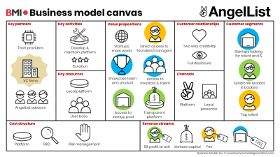

---
weight: 
title: "Angel List 翻译站点"
description: "Naval Ravikant，AngelList 联合创始人兼首席执行官，于 2010 年创立 AngelList，作为线上融资平台，一直致力于为互联网创业者与投资人的交流提供沟通渠道"
date: 2022-07-15T21:57:40+08:00
lastmod: 2022-07-15T16:45:40+08:00
draft: false
authors: ["MineW"]
featuredImage: "angel-list.jpg"
link: "https://www.angellist.com/"
tags: ["投资机构","Angel List 翻译站点"]
categories: ["navigation"]
navigation: ["投资机构"]
lightgallery: true
toc: true
pinned: false
recommend: false
recommend1: false
---
Naval Ravikant，AngelList 联合创始人兼首席执行官，于 2010 年创立 AngelList，作为线上融资平台，一直致力于为互联网创业者与投资人的交流提供沟通渠道。

#### ‎我们是世界上最大的创业社区。我们帮助初创企业改变世界‎

‎在AngelList，我们从根本上相信创业公司。 我们正在为初创公司建立一个权威的平台 - 他们筹集资金，建立团队，并推出他们的产品。‎

#### 投资改变世界的创业公司

加入领先的投资者，为下一波改变世界的初创公司提供资金。

#### 投资滚动基金

投资经验丰富的风险投资公司，支持初创公司，按季度订阅，并随着目标的发展调整您的投资。

